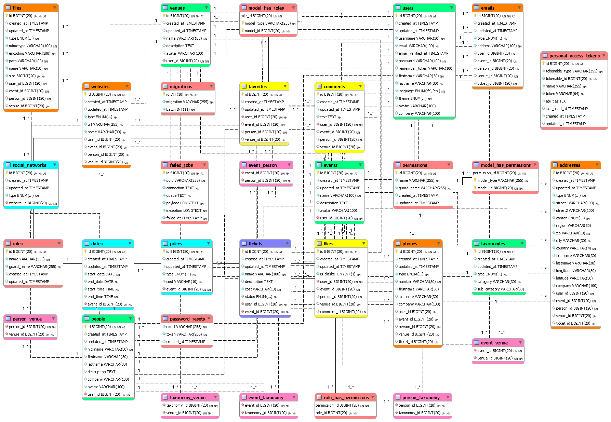
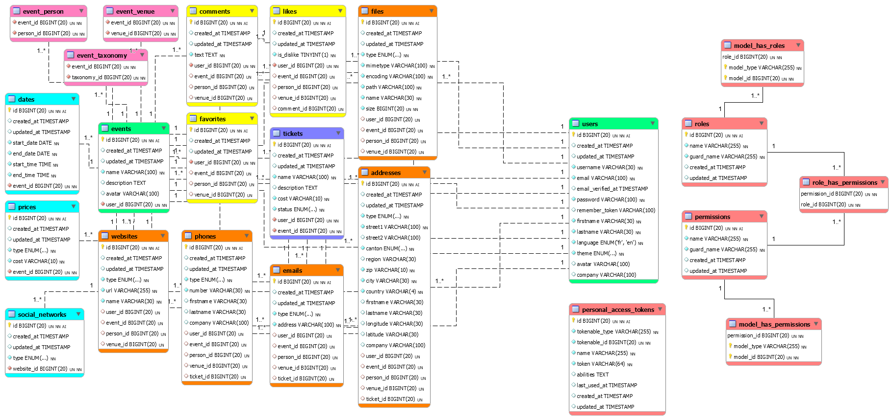

# Acetate

Acetate is a project currently under active development. It started on April 26, 2021 and was carried out as part of a personal work at the end of a web development learning course. Acetate aims to take stock of the available activities in the field of entertainment (conferences, exhibitions, music, theater)... The content of the site is made up of fake data. All pages and features are published for demonstration purposes. The source code of the project is free to access and fully available on github. Feel free to contact me for more information. Enjoy your visit.

# Stack : Laravel + Vue 2

[DEMO](https://acetate.unitysound.ch)

## EER Diagram (Complete Schema)

## EER Diagram (Events Schema)

## License
[MIT](https://github.com/axelfaya/acetate/blob/main/LICENSE.MD)
